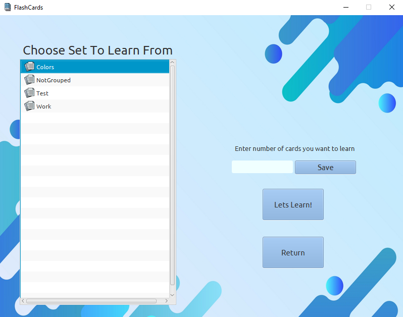

# FlashCards

***

## About a project

Projects aim is to build a GUI app which connects to MySQL database and uses logging and lombok libraries.
This app lets you create your own flashcards, sort them into sets and of course learn them!

***

## Technology Stack

* JDK 17.0.3 LTS (Language Level Java 11),
* Apache Maven 3.8.1,
* JUnit 5.8.2,
* Lombok 1.18.24,
* Logback 1.2.11,
* MySQL.

***

## Missing Enum Class

There is a missing Enum called `SQLSettings`. This is where you need to paste your own `mysql` settings.

* Create enum `SQLSettings` in `main.src.java.pl.edu.pw.ee.flashcards.database`,
* Use following pattern:

```java
public enum SQLSettings {
    URL("Your url"), USER("Your user"), PASSWORD("Your password");

    private final String string;

    SQLSettings(String string){
        this.string = string;
    }

    public String getString() {
        return string;
    }
}
```

***

## Credits to Authors

Icons and font I used are not my property, and I do not claim the ownership of them.

* **Application Icon**: \
Source: [Flaticon.com](https://www.flaticon.com/free-icons/flash-cards), \
Author: [Freepik](https://www.flaticon.com/authors/freepik).

* **FlashCardIcon** \
Source: [Flaticon.com](https://www.flaticon.com/free-icon/card-games_3813722), \
Author: [Freepik](https://www.flaticon.com/authors/freepik).

* **CardSetIcon** \
Source: [Flaticon.com](https://www.flaticon.com/free-icon/paper_2541988), \
Author: [Freepik](https://www.flaticon.com/authors/freepik), 

* **BackGroundImage** \
Source: [Freepik.com](https://www.freepik.com/free-vector/blue-fluid-background_16326494.htm#query=graphics&position=22&from_view=search), \
Author: [rawpixel.com](https://www.freepik.com/author/rawpixel-com).

* **Ubuntu Font** \
Source: [Google Fonts](https://fonts.google.com/specimen/Ubuntu?query=Ub), \
Author: [Dalton Maag](https://fonts.google.com/?query=Dalton+Maag).
  
***

## ScreenShots

**Main Page**


**Adding Page**


**Managing Sets**


**Choosing Sets**


**Inserting Answer**


**Clicking Answer**


***
